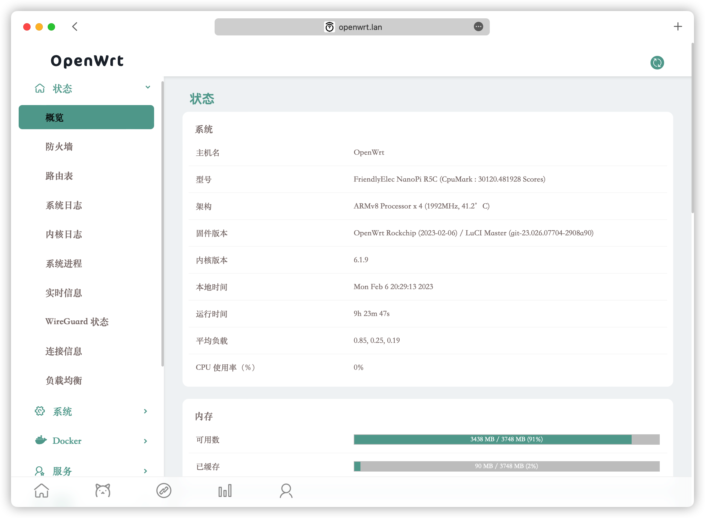
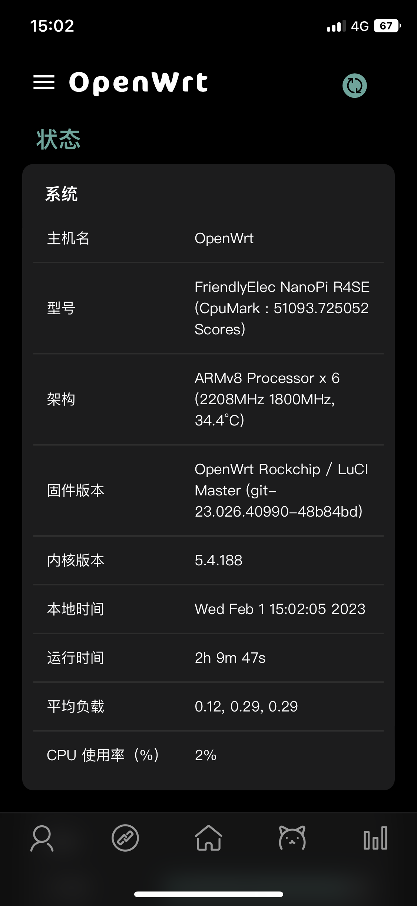
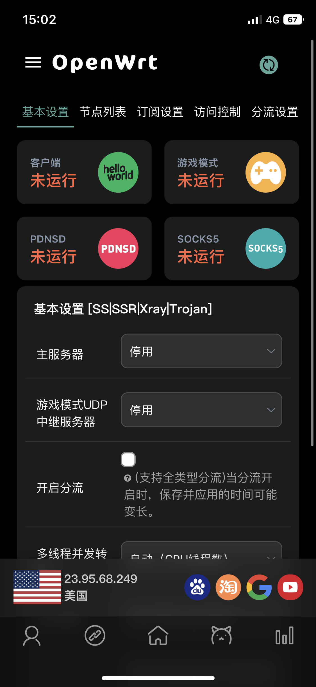
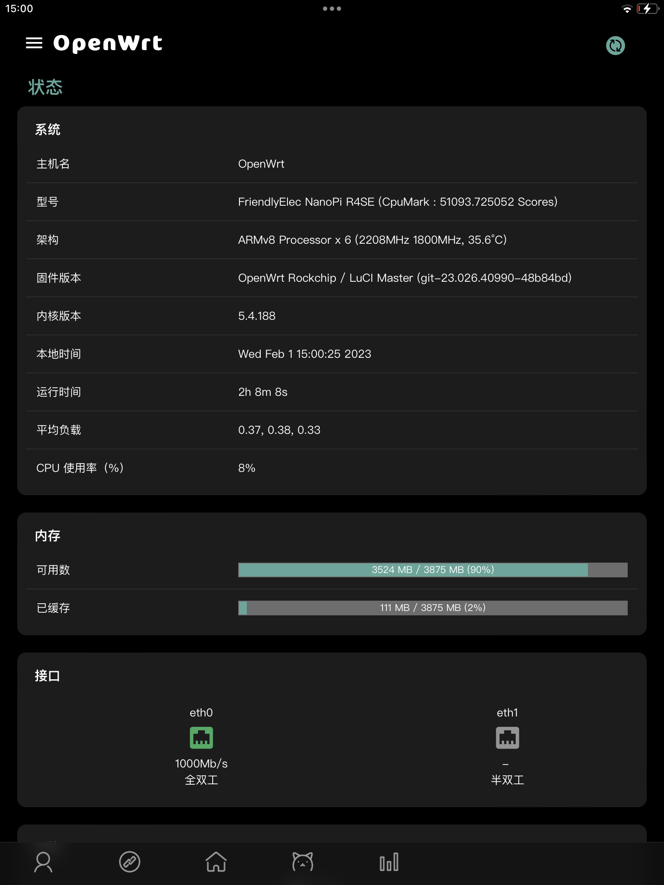
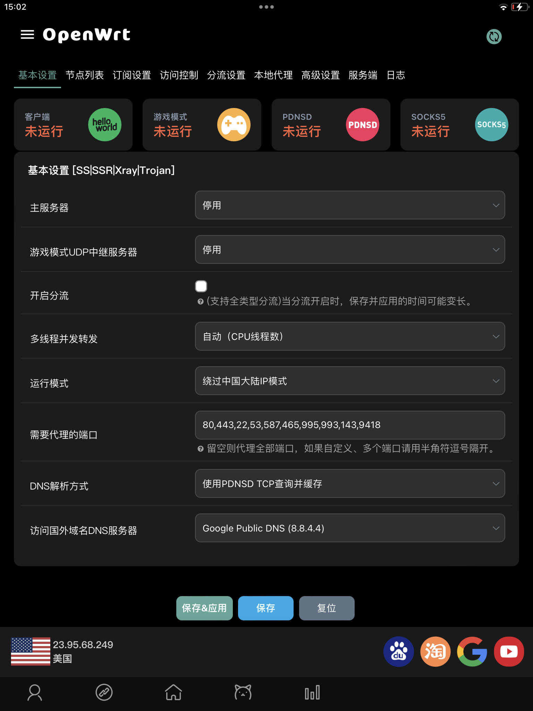
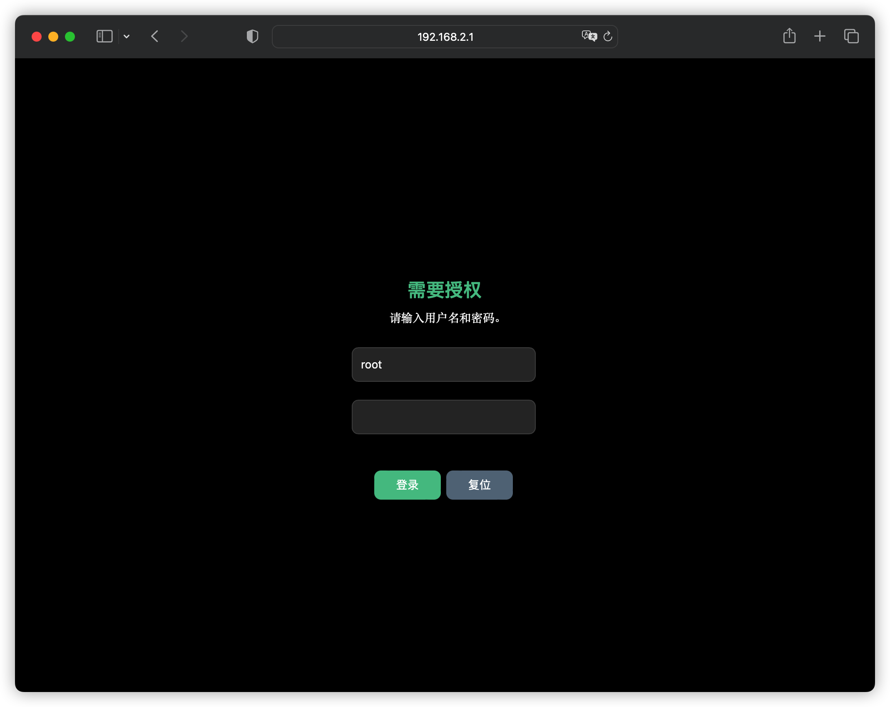
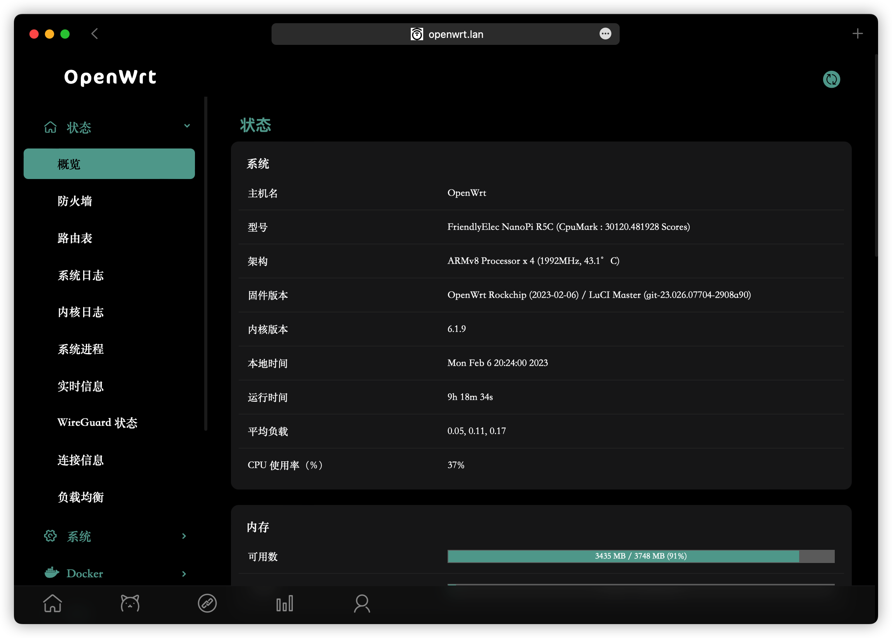
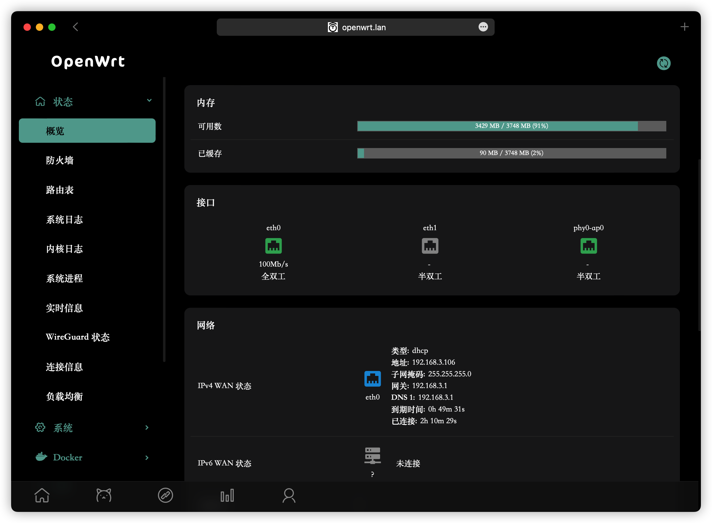
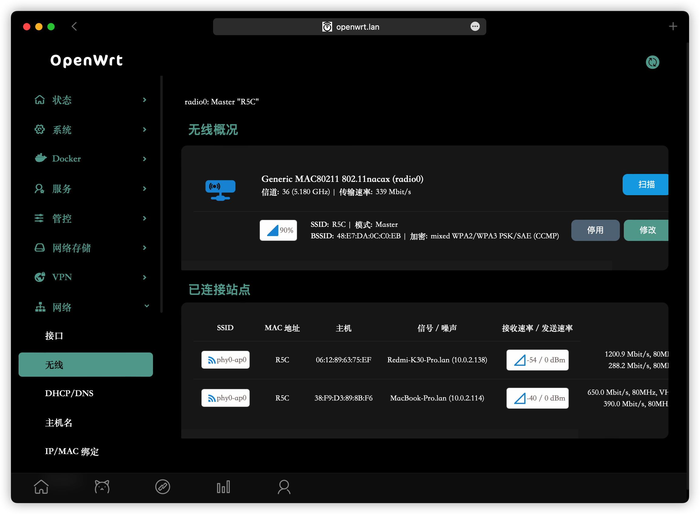
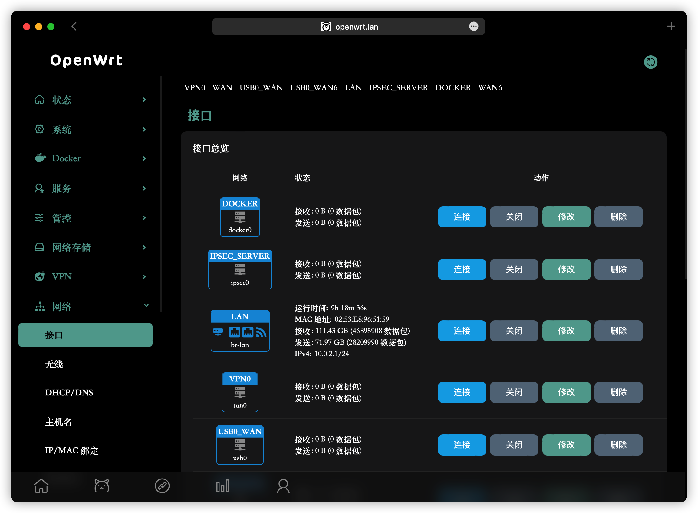

 

# luci-theme-design

**luci-theme-design**基于[luci-theme-neobird](https://github.com/thinktip/luci-theme-neobird)二次开发

## 版本支持

- ✅ OpenWrt 21.x
- ✅ OpenWrt 23.x  
- ✅ OpenWrt 24.x
- 适用于官方 [OpenWrt](https://github.com/openwrt/openwrt)

- 修复安装package提示信息背景泛白
- 优化菜单缩放
- 优化显示网口down状态显示图标
- 优化logo显示
- 新增各设备状态图标显示
- 更换logo显示为字体"OpenWrt"，支持以主机名显示logo
- 修复部分插件显示bug
- 修复vssr状态bar
- 修复诸多bug
- 修复兼容部分插件样式
- 修复aliyundrive-webdav样式
- 修复vssr在iOS/iPadOS WebApp模式下显示异常
- 修复openclash插件在iOS/iPadOS WebApp 模式下env(safe-area-inset-bottom) = 0
- 优化菜单hover action状态分辨
- 支持luci-app-wizard向导菜单
- Update header box-shadow style
- Update uci-change overflow
- Fix nlbw component
- Added QSDK/QWRT wizard and iStore menu icon fonts
- 新增 OpenWrt 23/24 版本兼容支持
- 优化 LuCI 新旧版本兼容层
- 修复新版本 API 调用问题

## 主要特点

- 针对移动端优化，特别适合手机端做为webapp使用
- 修改和优化了很多插件显示，完善的icon图标，尽量视觉统一
- 简洁的登录界面，底部导航栏，类App的沉浸式体验；
- 适配深色模式，适配系统自动切换；

## 体验Webapp方法

- 在移动端(iOS/iPadOS)浏览器打开管理界面，添加到主屏幕即可。
- 想要实现完全的沉浸式（无浏览器导航、无地址栏等）体验，需要使用SSL证书，请自行申请域名、证书、安装并启用。
- 如果不使用SSL证书，基于安全原因，iOS/iPadOS 在打开新的页面后，将会显示浏览器顶部菜单栏。

## PS

- 资源接口icon未完善，如果有能力画图的欢迎pr，但请确保跟现有icon颜色风格一致
- 有bug欢迎提issue
- 主题个人配色可能会不符合大众胃口，欢迎提配色建议

## 自行编译

### OpenWrt 21/23/24 通用方法

```bash
# 进入 OpenWrt 源码目录
cd openwrt

# 克隆主题到 package 目录
git clone https://github.com/gngpp/luci-theme-design.git package/luci-theme-design

# 配置编译选项
make menuconfig
# 选择: LuCI -> 3. Themes -> luci-theme-design

# 编译
make package/luci-theme-design/compile V=s
```

### 安装后测试

```bash
# 上传测试脚本到路由器
scp test-compatibility.sh root@192.168.1.1:/tmp/

# SSH 登录路由器
ssh root@192.168.1.1

# 运行兼容性测试
sh /tmp/test-compatibility.sh
```

### 手动激活主题

如果主题未自动激活，可以手动设置：

```bash
uci set luci.main.mediaurlbase='/luci-static/design'
uci commit luci
/etc/init.d/uhttpd restart
```

## 版本兼容性

详细的兼容性信息请查看 [COMPATIBILITY.md](COMPATIBILITY.md)

- OpenWrt 21.x - 完全支持 ✅
- OpenWrt 23.x - 完全支持 ✅  
- OpenWrt 24.x - 完全支持 ✅

## 故障排除

### 主题显示异常
1. 清除浏览器缓存（Ctrl+F5 强制刷新）
2. 检查主题文件是否完整安装
3. 运行兼容性测试脚本

### 菜单无法展开
1. 检查浏览器控制台是否有 JavaScript 错误
2. 确认 LuCI 版本兼容性
3. 尝试禁用浏览器扩展

### 移动端显示问题
1. 确保使用 HTTPS（WebApp 模式需要）
2. 清除浏览器缓存
3. 重新添加到主屏幕

## 预览(ps: 下面PC端普通字体为苹果浏览器字体，只有移动端是正常显示的)

<details> <summary>iOS</summary>


</details>

<details> <summary>iPadOS</summary>


</details>







